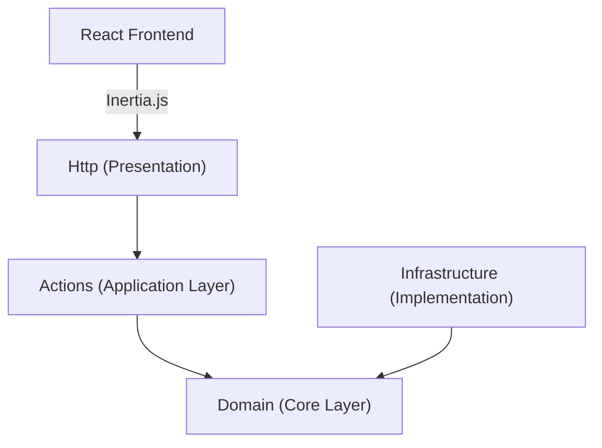

# 🛩️ WayFleet

[](https://laravel.com)
[](https://react.dev)
[](https://tailwindcss.com)
[](https://www.typescriptlang.org/)

**WayFleet** is a modern logistics management platform built with the most advanced Laravel and React ecosystem. Designed under **Hexagonal Architecture** principles to ensure scalability, maintainability, and exceptional performance.

---

## 🏛️ Software Architecture

The project follows a **Clean/Hexagonal** architecture, separating business rules from implementation details:



### Project Layers

- **`app/Domain`**: Contains pure entities, business exceptions, and interfaces (Contracts). It is the heart of the system, free of external dependencies.
- **`app/Infrastructure`**: Technical implementations. This is where Eloquent repositories, external API integrations, and specific drivers reside.
- **`app/Actions`**: Specific use cases. Each action represents an atomic operation of the application.
- **`app/Http`**: Controllers acting as adapters for web requests, delegating logic to the Actions.

---

## 🚀 Tech Stack

### Backend

- **Laravel 12**: The PHP framework for web artisans.
- **Wayfinder**: Typed action and routing system that synchronizes the backend with the frontend.
- **Fortify**: Robust authentication management.
- **Eloquent ORM**: Database relational mapping with Repository support.

### Frontend

- **React 19 & TypeScript**: Modern UI with strict typing.
- **Inertia.js 2.0**: The "perfect glue" between the SPA and the Monolith.
- **Tailwind CSS 4**: Next-generation styles powered by a high-performance engine.
- **Shadcn/UI & Radix UI**: Accessible and elegant UI components.
- **TanStack Table**: Advanced data table management.
- **Sileo**: Integrated notification system.

---

## 🛠️ Installation & Setup

The project includes an automation script for quick configuration:

1. **Clone the repository:**

   ```bash
   git clone git@github.com:PedroDmian/Wayfleet.git
   cd WayFleet
   ```

2. **Run the automatic setup:**

   ```bash
   composer setup
   ```

   _This command will install dependencies (PHP/JS), generate the key, run migrations, and compile assets._

3. **Start the development environment:**
   ```bash
   composer dev
   ```

---

## 📂 Directory Structure

```text
app/
├── Actions/        # Use cases / Application commands
├── Domain/         # Core business logic (Interfaces, DTOs)
├── Infrastructure/ # Technical implementations (Repositories)
├── Http/           # Web adapters (Controllers, Middleware)
├── Models/         # Eloquent models
resources/js/
├── components/     # Shared components (Shadcn/UI)
├── layouts/        # Page structures
├── pages/          # Inertia views
└── lib/            # Utilities and configuration
```

---

## 💎 Premium Features

- **End-to-End Typing**: Thanks to Wayfinder, routes and actions are available in the frontend with native autocompletion.
- **Dynamic DataTables**: Robust implementation of tables with search, filtering, and optimized pagination.
- **Refined UI/UX**: Native Dark Mode support, loading states, and fluid transitions.
- **Clean Code**: Strict adherence to SOLID principles and PSR-12.

---

Built with ❤️ for high-level logistics management.
